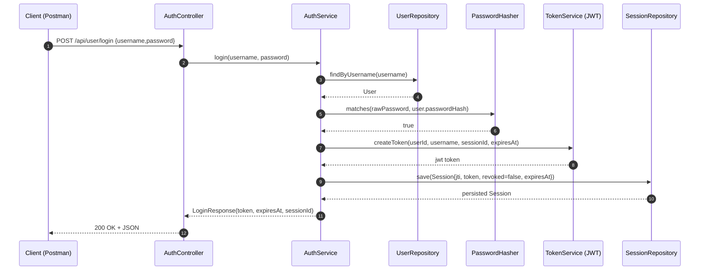

# Login Documentation

## Goal
The login endpoint creates a JWT token and a session record in the database.  
The token is then used as `Authorization: Bearer <token>` for protected endpoints.

## API Endpoint
- Method: `POST`
- Path: `/api/user/login`
- Access: `permitAll` (no token required)

Request body:
```json
{
  "username": "anna",
  "password": "mySecret123"
}
```

Success response (`200 OK`):
```json
{
  "token": "<jwt>",
  "expires_at": "2026-03-12T18:45:00Z",
  "session_id": "0195c7d4-8d68-7f3f-bf38-9b98f3e8f0af"
}
```

## Components and Responsibilities
- `AuthController.login(...)`
  - receives the HTTP request and delegates to the service.
- `AuthService.login(...)`
  - validates user + password
  - creates session ID and expiration timestamp
  - creates JWT
  - stores session
  - returns `LoginResponse`
- `UserRepository`
  - loads the user by username
- `PasswordHasher`
  - compares plaintext password with stored hash
- `TokenService` (`JwtTokenService`)
  - creates/signs JWT
- `SessionRepository`
  - persists session (`jti`, `token`, `expires_at`, `revoked=false`)

## Code Flow (Step by Step)
1. `POST /api/user/login` reaches `AuthController.login(...)`.
2. Controller calls `authService.login(username, password)`.
3. `AuthService` loads the user via `userRepository.findByUsername(...)`.
4. `passwordHasher.matches(...)` verifies the password.
5. `AuthService` creates:
   - `sessionId` (UUIDv7)
   - `expiresAt` (`now + security.jwt.expiration-minutes`)
6. `tokenService.createToken(...)` builds JWT with claims (`uid`, `sub`, `jti`, `exp`).
7. Session is stored with `sessionRepository.save(...)`.
8. Service returns `LoginResponse(token, expiresAt, sessionId)` to controller.
9. Controller returns `200 OK`.

## Visualization (Who Does What)


## Example: Login to Protected Request
1. Login:
```bash
curl -X POST http://localhost:8080/api/user/login \
  -H "Content-Type: application/json" \
  -d "{\"username\":\"anna\",\"password\":\"mySecret123\"}"
```
2. Copy the token from the response.
3. Send the token to a protected endpoint, for example logout:
```bash
curl -X POST http://localhost:8080/api/user/logout \
  -H "Authorization: Bearer <jwt>"
```

## What Happens on Follow-up Requests
For each request with Bearer token, `JwtAuthenticationFilter` runs:
1. Token is parsed and validated.
2. Session is loaded by `jti`.
3. Request is authenticated only if:
   - `revoked == false`
   - `expires_at > now`
   - stored token == incoming token

This makes session revocation and session expiry effective in addition to JWT validation.
