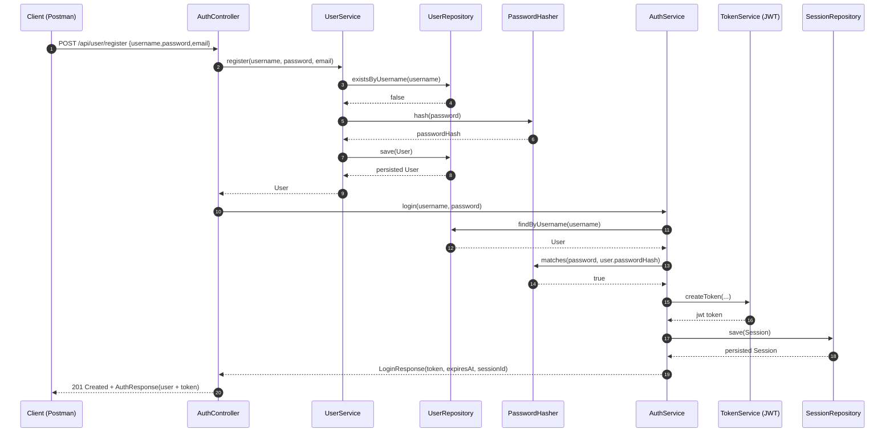

# Register Documentation

## Goal
The register endpoint creates a new user account and directly returns an authentication token.  
In the current implementation, registration is followed by an internal login call.

## API Endpoint
- Method: `POST`
- Path: `/api/user/register`
- Access: `permitAll` (no token required)

Request body:
```json
{
  "username": "anna",
  "password": "mySecret123",
  "email": "anna@example.com"
}
```

Success response (`201 Created`):
```json
{
  "userId": "0195c7f3-4238-73f3-a242-8f77e5dbe67a",
  "username": "anna",
  "created_at": "2026-03-12T18:20:12.102Z",
  "token": "<jwt>"
}
```

## Components and Responsibilities
- `AuthController.register(...)`
  - accepts the HTTP request.
  - creates the user via `UserService.register(...)`.
  - performs internal login via `AuthService.login(...)`.
  - returns `AuthResponse` with user info and token.
- `UserService.register(...)`
  - validates username/password.
  - checks if username already exists.
  - hashes password.
  - creates and stores user.
- `AuthService.login(...)`
  - validates credentials against stored password hash.
  - creates JWT token and session.
  - returns `LoginResponse`.
- `UserRepository`
  - checks uniqueness and persists/loads user.
- `PasswordHasher`
  - hashes and verifies passwords.
- `TokenService` (`JwtTokenService`)
  - creates/signs JWT.
- `SessionRepository`
  - persists login session (`jti`, `token`, `expires_at`, `revoked=false`).

## Code Flow (Step by Step)
1. `POST /api/user/register` reaches `AuthController.register(...)`.
2. Controller calls `userService.register(username, password, email)`.
3. `UserService` validates input and checks `existsByUsername(...)`.
4. Password is hashed and user is saved.
5. Controller calls `authService.login(username, password)`.
6. `AuthService` validates credentials and creates JWT + session.
7. Controller builds `AuthResponse`:
   - `userId`, `username`, `created_at` from newly created user.
   - `token` from `LoginResponse`.
8. Controller returns `201 Created`.

## Visualization (Who Does What)


## Example: Register and Use Token
1. Register:
```bash
curl -X POST http://localhost:8080/api/user/register \
  -H "Content-Type: application/json" \
  -d "{\"username\":\"anna\",\"password\":\"mySecret123\",\"email\":\"anna@example.com\"}"
```
2. Copy `token` from response.
3. Call a protected endpoint:
```bash
curl -X POST http://localhost:8080/api/user/logout \
  -H "Authorization: Bearer <jwt>"
```

## Important Notes
- If `username` already exists, registration fails with an error.
- If `username` or `password` is blank, registration fails with an error.
- Registration currently triggers a real login flow to generate the token and create a session.
